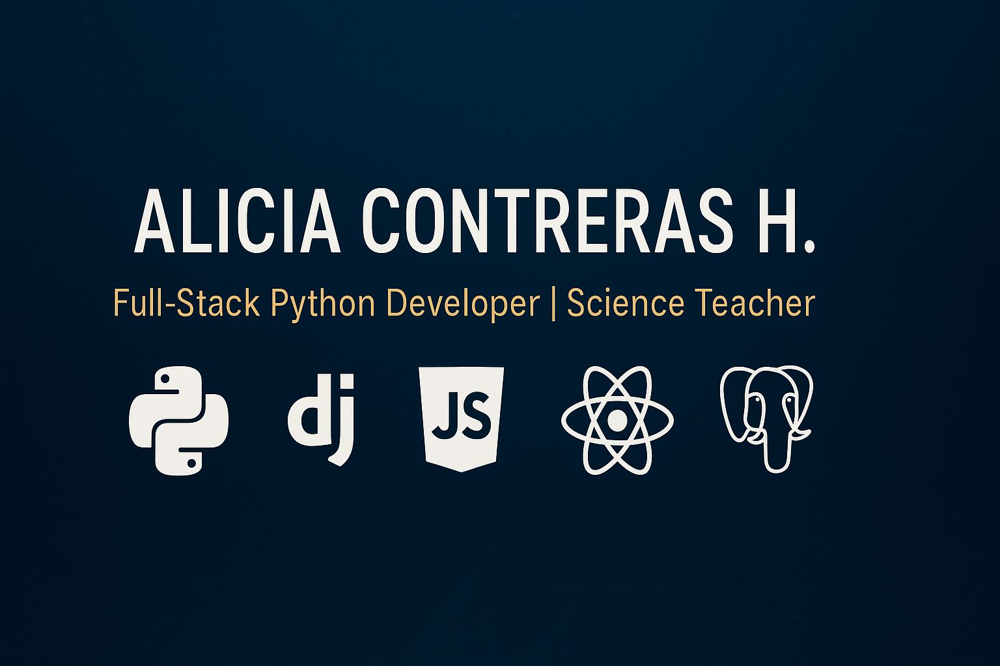
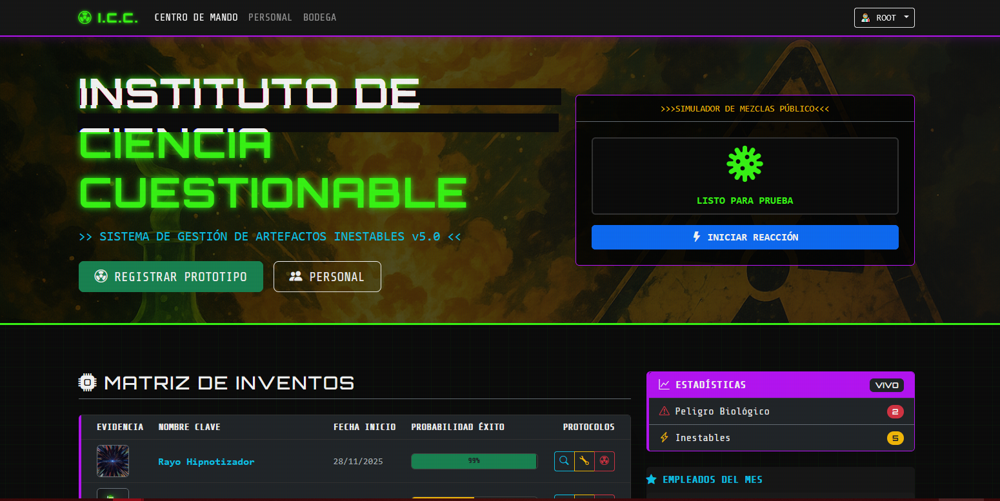
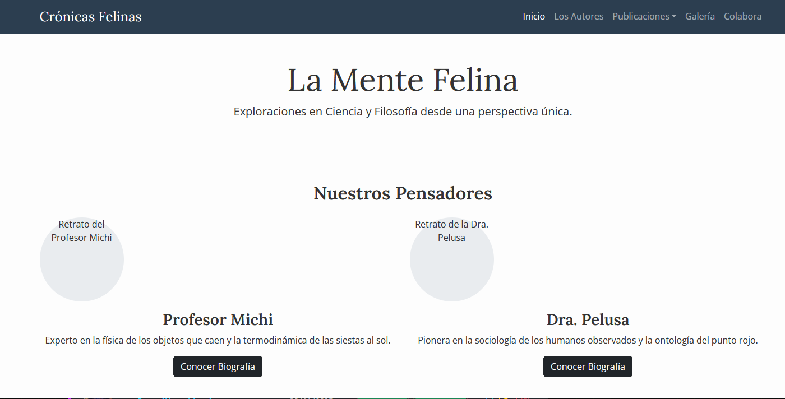
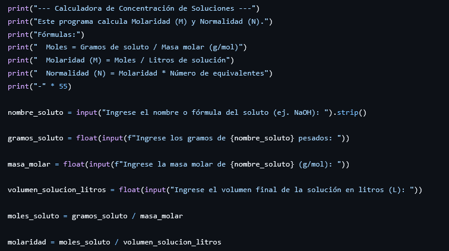

<!-- Banner Opcional -->

  

# Alicia Macarena Contreras Hormazábal
### Desarrolladora Full-Stack Python | Profesora de Ciencias

Combinando mi pasión por la enseñanza y la tecnología, me he formado como Desarrolladora Full-Stack. Mi experiencia como profesora me ha dado una gran capacidad para investigar y resolver problemas complejos, y ahora aplico esa habilidad para construir aplicaciones web intuitivas y eficientes utilizando Python, Django, JavaScript y HTML/CSS. Soy una persona que aprende rápido y busca constantemente nuevos desafíos.

  <a href="#-proyectos-destacados"><strong>Ver mis Proyectos »</strong></a>
  &nbsp;&nbsp;&nbsp;
  <a href="#-contacto"><strong>Contactarme »</strong></a>

---

## 🚀 Proyectos Destacados

### 1. Instituto de Ciencia Cuestionable (Sistema de Gestión Full-Stack)
*Aplicación web completa construida con Django para la gestión integral de un laboratorio. El sistema administra inventarios, personal y experimentos, implementando una base de datos relacional compleja y una interfaz de usuario moderna.*

**Tecnologías:**

  
  
  
  
  
  

<a href="https://github.com/AliciaContreras/ICC"><strong>Ver más detalles »</strong></a>

---

### 2. Portafolio Científico Felino (Front-End)
*Sitio web estático y responsivo que presenta un portafolio creativo. Se utilizaron herramientas de front-end para crear una experiencia de usuario dinámica e interactiva, demostrando competencias en maquetación y manipulación del DOM.*

**Tecnologías:**

  
  
  
  
  

<a href="https://github.com/AliciaContreras/MIS_GATOS"><strong>Ver el Sitio »</strong></a>

---

### 3. Suite de Herramientas Científicas (Python)
*Colección de scripts de consola programados en Python para resolver problemas comunes de física y química. Incluye calculadoras de masa molar, conversión de unidades y cinemática, demostrando un fuerte dominio de la lógica de programación.*

**Tecnologías:**

  

<a href="https://github.com/AliciaContreras/programas_Python_Basico"><strong>Ver Código en GitHub »</strong></a>

---

## 👩‍💻 Sobre Mí

Como profesora de ciencias, siempre me ha fascinado resolver problemas. Mi curiosidad me llevó a explorar el mundo de la programación como una herramienta para llevar mis ideas más allá del aula y el laboratorio. Quise aprender a programar para poder crear mis propias herramientas de análisis científico y desarrollar recursos didácticos interactivos para mis clases.

Esta pasión por la creación me ha llevado a experimentar con tecnologías como Arduino y a formarme como Desarrolladora Full-Stack. Disfruto cada etapa del proceso de desarrollo, desde la conceptualización de una idea hasta la implementación de una solución funcional y limpia. Mi objetivo es fusionar mi experiencia en ciencias con mis habilidades técnicas para trabajar en proyectos que sean tanto desafiantes como significativos.

---

## 📫 Contacto

¿Tienes alguna pregunta o un proyecto en mente? ¡Hablemos! Estoy abierta a nuevas oportunidades y colaboraciones.

- **Email:** [alicia.contreras.h@mail.pucv.cl](mailto:alicia.contreras.h@mail.pucv.cl)
- **LinkedIn:** [linkedin.com/in/alicia-contreras-h](https://www.linkedin.com/in/alicia-contreras-h)
- **GitHub:** [github.com/AliciaContreras](https://github.com/AliciaContreras)
